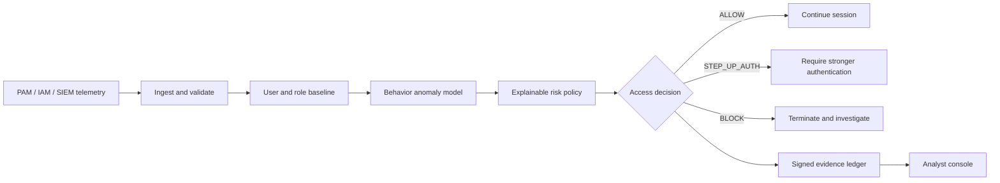

# Aegis Command

**Explainable control for privileged access.**

Aegis Command evaluates high-impact administrative sessions while they are in progress. It combines behavioral anomaly detection, explicit security context, and deterministic threat rules to return one of three decisions: `ALLOW`, `STEP_UP_AUTH`, or `BLOCK`. Every decision includes the factors that produced the score, the enforcement outcome, and an auditable evidence record.

The system is designed to complement a bank's PAM, IAM, SIEM, and incident-response stack. It does not execute submitted command text and it does not treat an anomaly score as proof of malicious intent.

## Demo

- Product walkthrough: <https://www.youtube.com/watch?v=XyqpGPwfOkI>
- Live console: <https://web-production-35cc9.up.railway.app>
- API readiness: <https://api-production-62b42.up.railway.app/api/v1/health/ready>
- OpenAPI reference: <https://api-production-62b42.up.railway.app/docs>

The hosted demo uses deterministic banking scenarios so reviewers can inspect normal activity, step-up authentication cases, blocked privileged misuse, enforcement results, and the signed audit trail without needing to create their own telemetry first.

## Capabilities

| Area | What is implemented |
|---|---|
| Real-time assessment | Versioned HTTP API for privileged-session telemetry with stable producer event IDs |
| Behavior analytics | User and role baselines, Isolation Forest inference, contextual weighting, and deterministic threat markers |
| Risk-based access | Configurable thresholds for allow, stronger authentication, and block decisions |
| Explainability | Ranked factors with normalized signals, policy weights, and score contribution |
| Enforcement | Sandbox adapter plus signed, retry-safe PAM/IAM webhook integration |
| Evidence | Idempotent decision ledger, analyst actions, correlation IDs, and exportable audit history |
| Post-quantum controls | ML-KEM vault envelope and ML-DSA decision signatures through Open Quantum Safe |
| Operations | PostgreSQL migrations, readiness checks, Prometheus metrics, RBAC, trusted hosts, and request limits |

## System flow



The repository uses a modular monolith so the assessment transaction remains understandable and replay-safe. Domain and adapter boundaries allow model inference, enforcement, or persistence to be separated later without changing the public contracts.

## Repository layout

```text
apps/
  api/          FastAPI service, analytics, policy, persistence, and PQC modules
  web/          React and TypeScript security-operations console
docs/           Architecture, operations, threat model, deployment, and ADRs
infra/docker/   Reproducible API and web container images
scripts/        Deterministic reference-data and development utilities
```

## Quick start

Requirements: Docker Desktop with Docker Compose.

```powershell
docker compose up --build
```

Open the following endpoints after both health checks pass:

- Console: <http://localhost:5173>
- OpenAPI: <http://localhost:8000/docs>
- Readiness: <http://localhost:8000/api/v1/health/ready>

Compose uses the disposable local keys defined in `compose.yaml`. Replace them before exposing either service outside your machine. Use `.env.example` as the configuration reference when running the services directly or creating hosted service variables.

### Load the reference scenario dataset

The seed utility creates nine deterministic sessions: four routine, two step-up, and three block scenarios.

```powershell
python scripts/seed_demo.py --api-base http://127.0.0.1:8000/api/v1/ --api-key demo-admin-key-2026
```

For a local SQLite development server, use `--reset-local-db` to clear only the guarded `apps/api/aegis_command.db` file before seeding. The reset option intentionally refuses remote APIs and PostgreSQL databases. See [Reference scenario data](docs/demo-data.md).

## Configuration

Copy `.env.example` and change values for the target environment. The principal settings are:

| Variable | Purpose |
|---|---|
| `AEGIS_DATABASE_URL` | SQLAlchemy async URL; provider `postgres://` and `postgresql://` URLs are normalized to asyncpg |
| `AEGIS_AUTH_ENABLED` | Enables API-key authentication and role checks |
| `AEGIS_API_KEYS` | JSON object mapping keys to `observer`, `analyst`, or `admin` |
| `AEGIS_CORS_ORIGINS` | JSON list of allowed console origins |
| `AEGIS_TRUSTED_HOSTS` | JSON list accepted by trusted-host middleware |
| `AEGIS_PQC_REQUIRED` | Fails startup when the native Open Quantum Safe runtime is unavailable |
| `AEGIS_ENFORCEMENT_SANDBOX_ENABLED` | Records realistic enforcement success without contacting an external PAM |
| `AEGIS_ENFORCEMENT_WEBHOOK_URL` | Optional PAM/IAM enforcement endpoint |
| `AEGIS_ENFORCEMENT_WEBHOOK_SECRET` | HMAC secret used to sign webhook bodies |

`VITE_API_BASE_URL`, `VITE_API_KEY`, and `VITE_ADMIN_API_KEY` are compiled into the browser bundle. They are suitable only for a controlled demonstration. A shared or production deployment should use OIDC and a backend-for-frontend instead of browser-visible static credentials.

## API workflow

Submit a privileged session to `POST /api/v1/assessments`. The service then:

1. Validates the event and claims its stable `event_id`.
2. Extracts behavioral and security-context features.
3. Runs the fitted Isolation Forest and contextual risk policy.
4. Selects an access action from the persisted thresholds.
5. Signs the canonical decision when ML-DSA is available.
6. Invokes the enforcement adapter with an idempotency key.
7. Persists the explanation, enforcement state, and audit evidence.

Duplicate event delivery returns the original assessment and cannot create a second decision. Failed or interrupted enforcement is retried with the same idempotency key.

Important routes:

- `POST /api/v1/assessments` — assess a privileged session
- `GET /api/v1/overview` — operational summary and risk trend
- `GET /api/v1/sessions` — sortable investigation queue
- `GET /api/v1/sessions/{session_id}` — full evidence record
- `POST /api/v1/sessions/{session_id}/action` — analyst response
- `GET|PUT /api/v1/policies` — read or update risk thresholds
- `GET /api/v1/audit` — paginated evidence trail
- `GET /api/v1/health/ready` — dependency readiness
- `GET /api/v1/operations/metrics` — Prometheus metrics

## Local development

### API

Python 3.12 or newer is required. Native PQC is optional for local analytics work.

```powershell
Set-Location apps/api
python -m venv .venv
.\.venv\Scripts\Activate.ps1
python -m pip install -e ".[dev]"
$env:AEGIS_PQC_REQUIRED = "false"
fastapi dev src/aegis_command/main.py
```

Quality checks:

```powershell
pytest
ruff check .
mypy src
```

### Web console

Node.js 22 or newer is recommended.

```powershell
Set-Location apps/web
npm ci
npm run dev
```

Validation:

```powershell
npm run typecheck
npm run build
```

## Security posture

The Docker API image builds pinned Open Quantum Safe components and can require ML-KEM-768 and ML-DSA-65 at startup. A native-OQS-free local run uses a clearly identified compatibility mode and is never reported as quantum-safe.

This repository provides a serious integration reference, not a certified security appliance. Before production use, move private keys to an HSM or managed KMS, replace static keys with OIDC or workload identity, use mTLS to enforcement systems, redact sensitive command content, export evidence to immutable storage, add rate limits, and complete independent model and security validation.

## Deployment

The containers run as non-root users, apply Alembic migrations before API startup, honor the platform-provided `PORT`, and expose health endpoints. A complete Railway deployment procedure is available in [docs/deployment-railway.md](docs/deployment-railway.md).

## Documentation

- [Architecture](docs/architecture.md)
- [Operations guide](docs/operations.md)
- [Threat model](docs/threat-model.md)
- [Reference scenario data](docs/demo-data.md)
- [Railway deployment](docs/deployment-railway.md)
- [Architecture decision records](docs/adr/0001-modular-monolith.md)
