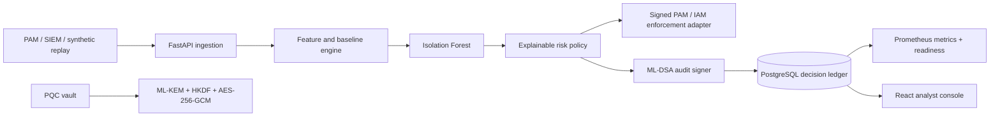

# System architecture

## Context

FinSpark Sentinel accepts privileged-session telemetry from a PAM, IAM, SIEM, or replay generator. It evaluates behavior against historical user and role baselines and returns a risk-based access decision. Analysts review the decision and its evidence in the web console.

## Runtime components

## Module boundaries

- **Domain** owns session, assessment, decision, and risk concepts. It has no framework dependencies beyond validation types.
- **Application** orchestrates analytics, policy, signing, persistence, and enforcement ports.
- **Analytics** owns deterministic feature extraction, baselines, synthetic data, model fitting, and inference.
- **Security** owns cryptographic envelopes and signatures behind interfaces.
- **Infrastructure** owns SQLAlchemy persistence and runtime integration.
- **API** owns HTTP translation, versioning, dependency lookup, and error mapping.

## Operational request path

Each producer assigns a stable `event_id`. The API claims that ID through a unique database
constraint before calling enforcement. Replayed events return the original assessment; pending or
failed enforcement is retried with the same `X-Idempotency-Key`. The webhook body is signed with
HMAC-SHA256, and its outcome and reference are persisted on the assessment. This closes the common
failure window where a decision is stored but enforcement is lost during a process restart.

Observer, analyst, and admin roles protect read, decision/review, and vault operations respectively.
Every response carries a correlation ID and browser-oriented security headers. Readiness checks the
database, model, PQC runtime, authentication configuration, and enforcement adapter; Prometheus
metrics expose HTTP latency, decisions, replay counts, and enforcement outcomes.

## Scaling path

The synchronous assessment path is stateless after model and baseline loading. API replicas can share PostgreSQL and a versioned model artifact. Database migrations run before the container starts; multi-replica production deployments should run them as a separate release job. At higher volume, event aggregation and model inference can move behind a durable queue while preserving the application contracts. Baseline updates must be serialized per user to avoid lost updates and must exclude unreviewed high-risk sessions.

## Data classification

Session telemetry is security-sensitive and may contain personal data. Command text should be tokenized or redacted at ingestion. Credentials never enter assessment logs. Vault plaintext is accepted only over authenticated transport and is never persisted or logged.
